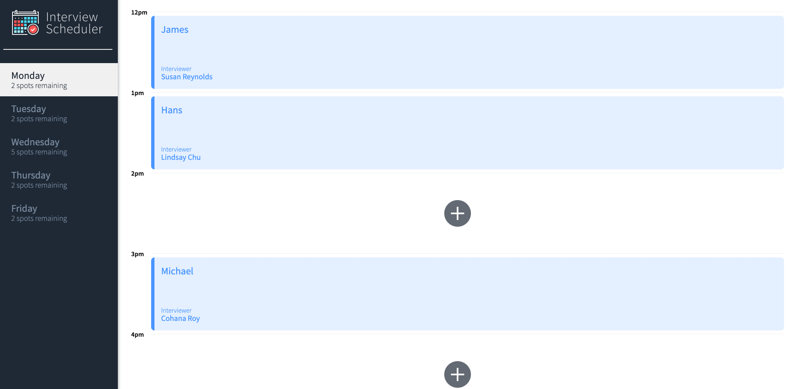
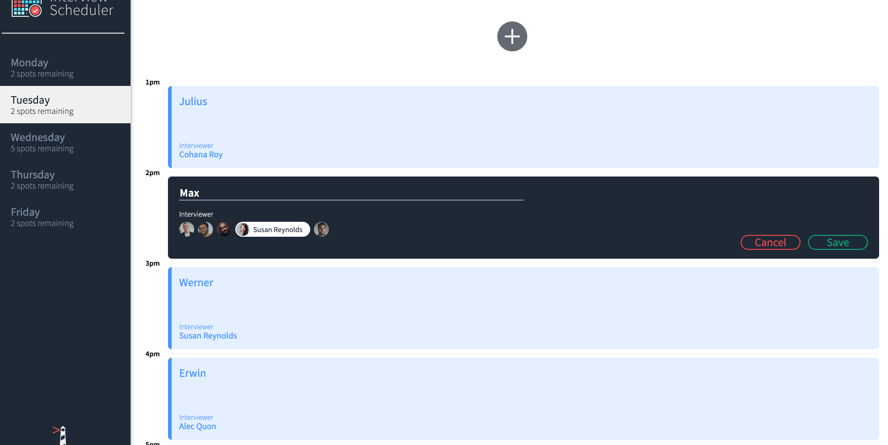
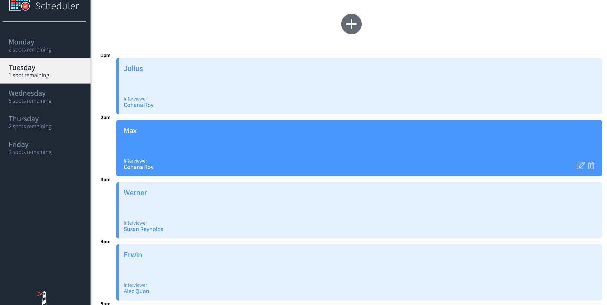

# Interview Scheduler
Interview scheduler is a single-page application built with React that allows users to book, cancel, and edit interviews. The application updates all users in real-time of any changes to the schedule.


## Setup

Install dependencies with `npm install`.

### Running Webpack Development Server

```sh
npm start
```

Navigate to `localhost:8000` in your browser to view the code. To test out the sockets feature, it is recommended to have two open simultaneously to see the live changes.

### Running the server
The api-server is provided by [Lighthouse labs](https://github.com/lighthouse-labs/scheduler-api). To run your own copy of the server you must clone and follow the instructions in the [provided readme](https://github.com/lighthouse-labs/scheduler-api/blob/master/README.md).


## Hosted Server
A working version of the project is enabled using CircleCI for continuous integration and netlify for continous deployment. It can be accessed using [https://romantic-nobel-c7aa08.netlify.com/](https://romantic-nobel-c7aa08.netlify.com/). The api-server is hosted by Heroku and will take some time to initially boot up (please try refreshing the page after 1-2 minutes).


## Demo/Example
When loading the app you should see a screen similar to the one below.

You can navigate to another day (e.g. Tuesday) to see appointments for that day.

Clicking on the `+` button will allow you to add a book an interview with an interviewer that is scheduled for that day.

If you have *another browser open* (simulating another user), you will see the interview automatically be synced for both clients.  You may also edit or delete any interviews that have been booked using the buttons provided on hover. 

Editing an interview will show an editable form with the pre-entered text and interviewer.

Deleting an interview will ask for a confirmation.

Once deleted the interview will be removed from all users connected to the application in real-time.


## Tech Stack
- React
- Websockets
- Axios
- Storybook, Jest, Cypress
- Webpack, babel


## Testing
### Running Jest Test Framework

```sh
npm test
```
- If running properly there should be 42 test cases.

### Running Storybook Visual Testbed

```sh
npm run storybook
```

### Running Cypress for end-to-end testing
```sh
npm run cypress
```
